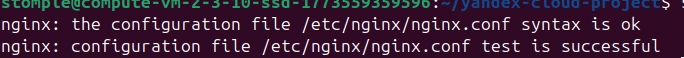
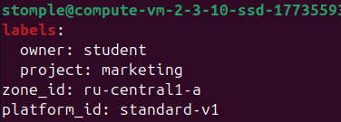
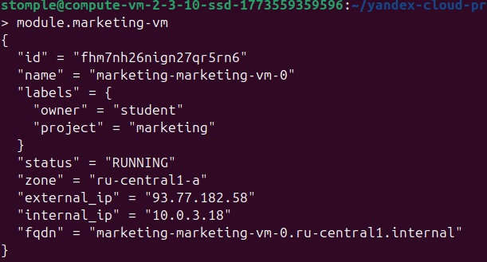
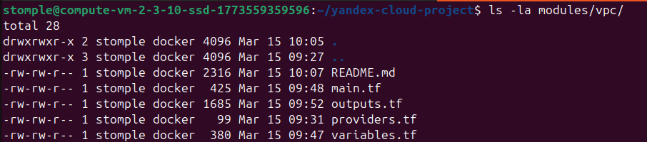
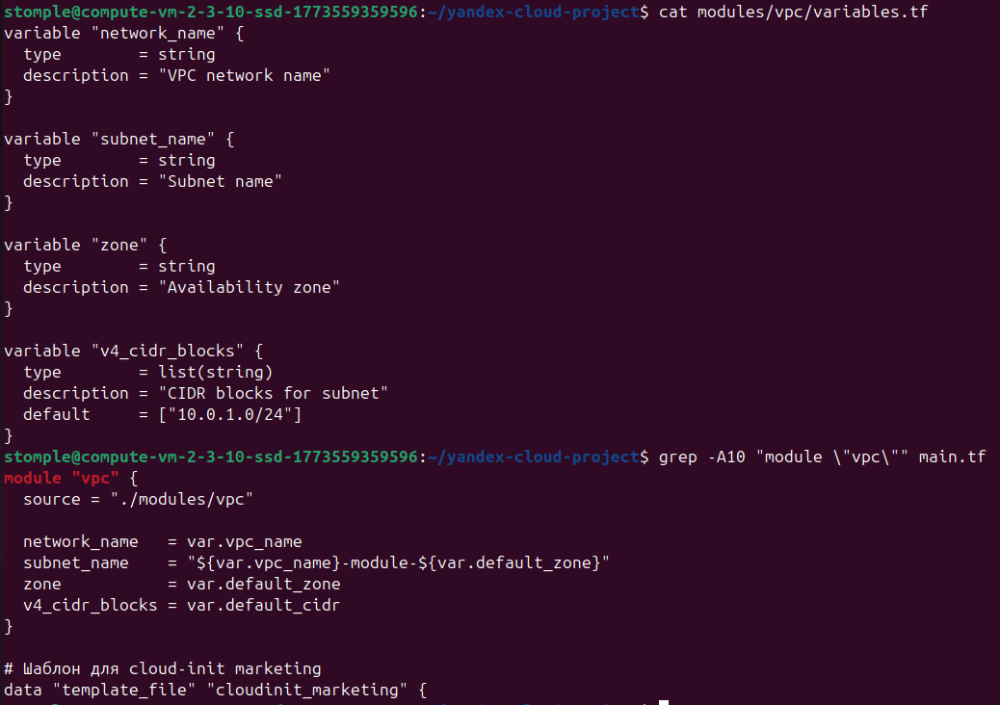
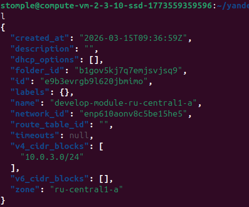

# Домашнее задание к занятию «Продвинутые методы работы с Terraform» Соколов Тимофей

### Цели задания

1. Научиться использовать модули.
2. Отработать операции state.
3. Закрепить пройденный материал.


### Чек-лист готовности к домашнему заданию

1. Зарегистрирован аккаунт в Yandex Cloud. Использован промокод на грант.
2. Установлен инструмент Yandex CLI.
3. Исходный код для выполнения задания расположен в директории [**04/src**](https://github.com/netology-code/ter-homeworks/tree/main/04/src).
4. Любые ВМ, использованные при выполнении задания, должны быть прерываемыми, для экономии средств.

------
### Внимание!! Обязательно предоставляем на проверку получившийся код в виде ссылки на ваш github-репозиторий!
Убедитесь что ваша версия **Terraform** ~>1.12.0
Пишем красивый код, хардкод значения не допустимы!
------

### Задание 1

1. Возьмите из [демонстрации к лекции готовый код](https://github.com/netology-code/ter-homeworks/tree/main/04/demonstration1) для создания с помощью двух вызовов remote-модуля -> двух ВМ, относящихся к разным проектам(marketing и analytics) используйте labels для обозначения принадлежности.  В файле cloud-init.yml необходимо использовать переменную для ssh-ключа вместо хардкода. Передайте ssh-ключ в функцию template_file в блоке vars ={} .
Воспользуйтесь [**примером**](https://grantorchard.com/dynamic-cloudinit-content-with-terraform-file-templates/). Обратите внимание, что ssh-authorized-keys принимает в себя список, а не строку.

Доказательство выполнения в дир zadanie1-1: https://github.com/stomplego/advanced-terraform-techniques-8-03-hw/tree/main/zadanie1-1

2. Добавьте в файл cloud-init.yml установку nginx. 

Доказательство выполнения в дир zadanie1-2, в файле result.txt: https://github.com/stomplego/advanced-terraform-techniques-8-03-hw/tree/main/zadanie1-2

3. Предоставьте скриншот подключения к консоли и вывод команды ```sudo nginx -t```, скриншот консоли ВМ yandex cloud с их метками. Откройте terraform console и предоставьте скриншот содержимого модуля. Пример: > module.marketing_vm





------
В случае использования MacOS вы получите ошибку "Incompatible provider version" . В этом случае скачайте remote модуль локально и поправьте в нем версию template провайдера на более старую.
------

### Задание 2

1. Напишите локальный модуль vpc, который будет создавать 2 ресурса: **одну** сеть и **одну** подсеть в зоне, объявленной при вызове модуля, например: ```ru-central1-a```.




2. Вы должны передать в модуль переменные с названием сети, zone и v4_cidr_blocks.

Доказательство выполнения в дир zadanie2-2: https://github.com/stomplego/advanced-terraform-techniques-8-03-hw/tree/main/zadanie2-2

3. Модуль должен возвращать в root module с помощью output информацию о yandex_vpc_subnet. Пришлите скриншот информации из terraform console о своем модуле. Пример: > module.vpc_dev  



4. Замените ресурсы yandex_vpc_network и yandex_vpc_subnet созданным модулем. Не забудьте передать необходимые параметры сети из модуля vpc в модуль с виртуальной машиной.

Доказательство выполнения в дир zadanie2-4: https://github.com/stomplego/advanced-terraform-techniques-8-03-hw/tree/main/zadanie2-4

5. Сгенерируйте документацию к модулю с помощью terraform-docs.
 
Пример вызова

```
module "vpc_dev" {
  source       = "./vpc"
  env_name     = "develop"
  zone = "ru-central1-a"
  cidr = "10.0.1.0/24"
}


Доказательство выполнения в дир zadanie2-5: https://github.com/stomplego/advanced-terraform-techniques-8-03-hw/tree/main/zadanie2-5

```

### Задание 3
1. Выведите список ресурсов в стейте.

Доказательство выполнения в дир zadanie3-1: https://github.com/stomplego/advanced-terraform-techniques-8-03-hw/tree/main/zadanie3-1

2. Полностью удалите из стейта модуль vpc.

Доказательство выполнения в дир zadanie3-2: https://github.com/stomplego/advanced-terraform-techniques-8-03-hw/tree/main/zadanie3-2

3. Полностью удалите из стейта модуль vm.

Доказательство выполнения в дир zadanie3-3: https://github.com/stomplego/advanced-terraform-techniques-8-03-hw/tree/main/zadanie3-3

4. Импортируйте всё обратно. Проверьте terraform plan. Значимых(!!) изменений быть не должно.
Приложите список выполненных команд и скриншоты процессы.

# Импорт подсети
echo "ИМПОРТ ПОДСЕТИ:" | tee -a zadanie3-4
docker run --rm -v $(pwd):/workspace -w /workspace \
  -v ~/.terraformrc:/root/.terraformrc:ro \
  hashicorp/terraform:1.12.0 import module.vpc.yandex_vpc_subnet.this e9b3evrgb9l620jbmimo 2>&1 | tee -a zadanie3-4
echo "" | tee -a zadanie3-4

# Импорт marketing VM
echo "ИМПОРТ MARKETING VM:" | tee -a zadanie3-4
docker run --rm -v $(pwd):/workspace -w /workspace \
  -v ~/.terraformrc:/root/.terraformrc:ro \
  hashicorp/terraform:1.12.0 import 'module.marketing-vm.yandex_compute_instance.vm[0]' fhm7nh26nign27qr5rn6 2>&1 | tee -a zadanie3-4
echo "" | tee -a zadanie3-4

# Импорт analytics VM
echo "ИМПОРТ ANALYTICS VM:" | tee -a zadanie3-4
docker run --rm -v $(pwd):/workspace -w /workspace \
  -v ~/.terraformrc:/root/.terraformrc:ro \
  hashicorp/terraform:1.12.0 import 'module.analytics-vm.yandex_compute_instance.vm[0]' fhmmmglcj125gn224j9p 2>&1 | tee -a zadanie3-4
echo "" | tee -a zadanie3-4

# Проверка state после импорта
{
  echo "=== ПРОВЕРКА STATE ПОСЛЕ ИМПОРТА ==="
  echo "Текущие ресурсы в стейте:"
  docker run --rm -v $(pwd):/workspace -w /workspace hashicorp/terraform:1.12.0 state list
  echo ""
} >> zadanie3-4 2>&1

# Выполнение terraform plan
{
  echo "=== РЕЗУЛЬТАТ TERRAFORM PLAN ==="
  echo "Выполняю terraform plan..."
  echo "----------------------------------------"
  docker run --rm -v $(pwd):/workspace -w /workspace hashicorp/terraform:1.12.0 plan
  echo "----------------------------------------"
} >> zadanie3-4 2>&1

Результат не стал скринить, т.к. он находится в дир zadanie3-4: https://github.com/stomplego/advanced-terraform-techniques-8-03-hw/tree/main/zadanie3-4
